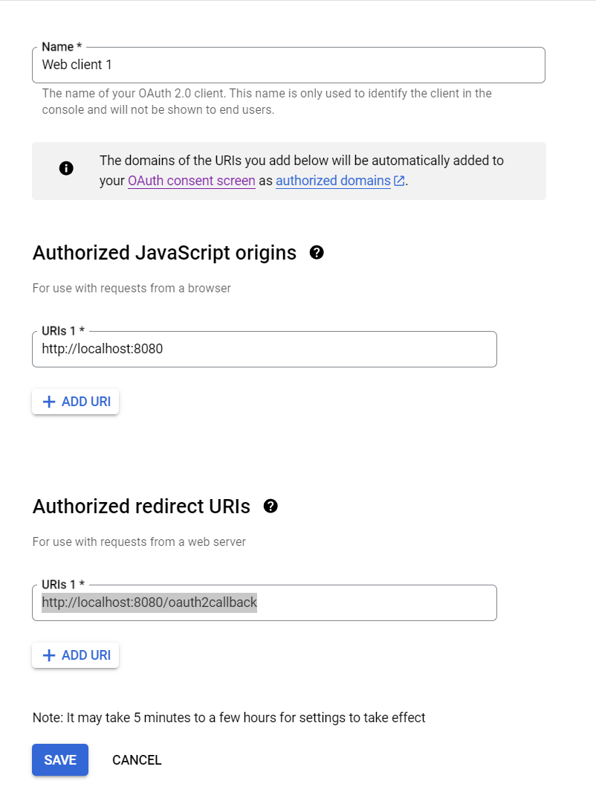

## Introduction

A toy backend implemented in `litestar` that has basic login, registration and authorisation with google oauth. Also provides a basic API to write event to google calendar. Note that there is no database here - the file itself is already 300 lines, I don't want to make it longer.

## Setup

Install dependencies:

```bash
pdm install
```
Note that the first two steps are also the first two steps in [here](https://developers.google.com/identity/protocols/oauth2).
- Install Calendar in your google cloud project (Dashboard > APIs & Service > Library).
- Then create a Web client OAuth2.0 credential (Dashboard > APIs & Services > Credentials).
- For simplicity, set `Authorized JavaScript origins` to `http://localhost:8080` and `Authorized redirect URIs` to `http://localhost:8080/oauth2callback`.
- Save the creds json file to `.creds/server_secret.json`



## How to run

```python
pdm run litestar --app src.app:app run --port 8080 --reload --debug
```


This is a [Next.js](https://nextjs.org/) project bootstrapped with [`create-next-app`](https://github.com/vercel/next.js/tree/canary/packages/create-next-app).

## Getting Started

First, run the development server:

```bash
npm run dev
# or
yarn dev
# or
pnpm dev
# or
bun dev
```

Open [http://localhost:3000](http://localhost:3000) with your browser to see the result.

You can start editing the page by modifying `app/page.tsx`. The page auto-updates as you edit the file.

This project uses [`next/font`](https://nextjs.org/docs/basic-features/font-optimization) to automatically optimize and load Inter, a custom Google Font.

## Learn More

To learn more about Next.js, take a look at the following resources:

- [Next.js Documentation](https://nextjs.org/docs) - learn about Next.js features and API.
- [Learn Next.js](https://nextjs.org/learn) - an interactive Next.js tutorial.

You can check out [the Next.js GitHub repository](https://github.com/vercel/next.js/) - your feedback and contributions are welcome!

## Deploy on Vercel

The easiest way to deploy your Next.js app is to use the [Vercel Platform](https://vercel.com/new?utm_medium=default-template&filter=next.js&utm_source=create-next-app&utm_campaign=create-next-app-readme) from the creators of Next.js.

Check out our [Next.js deployment documentation](https://nextjs.org/docs/deployment) for more details.
